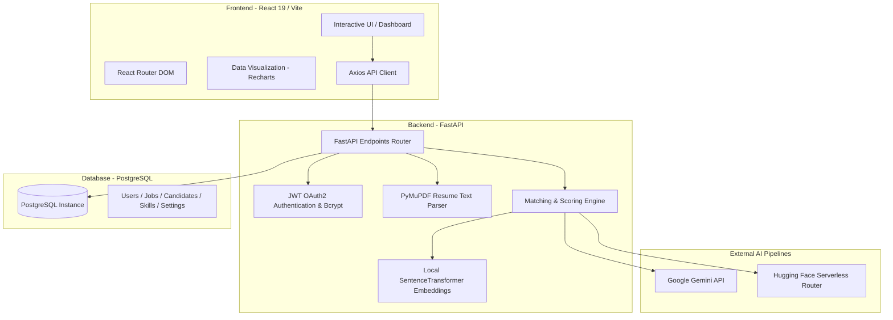

# HireAI: AI-Powered Resume Screening & Job Matching System

HireAI is an enterprise-grade recruitment platform designed to automate the screening, analysis, and matching of candidate resumes against job descriptions. It integrates state-of-the-art Large Language Models (LLMs) with local semantic search technologies to provide recruitment professionals with a high-fidelity matching and ranking score.

This document serves as a comprehensive system blueprint, detailing the features, technology stack, database schemas, AI model pipelines, and system configuration for presentation to the Technical Lead (TL).

---

## 🗺️ System Architecture Overview

The application utilizes a classic modern split-architecture with a React SPA frontend, a FastAPI ASGI backend, a PostgreSQL relational database, and an external dual-provider AI pipeline.



---

## 🚀 Key Features

HireAI offers a full-suite recruitment dashboard focused on automation and data-driven insights:

1. **User Authentication & Session Management**:
   - Secure registration and login using JWT (JSON Web Tokens) with HS256 signature algorithm.
   - Hashed password storage using `bcrypt`.
   - Role-based permissions supporting standard recruiter and Admin credentials.

2. **Job Postings & Requirements Specification**:
   - Structured job creation supporting job title, comprehensive description, required skills, optional skills, and minimum experience thresholds.

3. **Dual-AI Provider Resume Analysis**:
   - Extracts candidate profiles from PDF resumes using `PyMuPDF`.
   - Sends parsed text and job descriptions to a sequential model-fallback pipeline to extract structured data (candidate name, email, phone, skills, educational credentials, work experience history, and a synthesized AI assessment).

4. **Multi-Dimensional Semantic Match Engine**:
   - Calculates a weighted composite score (0-100%) for each candidate matching:
     - **Skill Score (40%)**: Ratio of matched skills out of the required skills list.
     - **Semantic Similarity (35%)**: Vector-embedding distance between the job description and the full resume.
     - **Experience Score (25%)**: Ratio of candidate's professional years against the job requirements.

5. **Advanced Interactive Dashboard**:
   - Real-time statistics including Total Jobs, Total Candidates, Avg AI Match Score, and Top Match profiles.
   - Rich SVG infographics: hiring activity timelines, progress widgets.
   - Data visualisations utilizing `Recharts`: Bar charts for candidate scores, pie charts for top required skills distribution, and bar charts for job applicant volumes.

6. **Candidate Profile Viewer & Comparison Panel**:
   - Interactive profile card rendering extracted employment/education history, verified skills lists, and contact information.
   - Side-by-side comparative table allowing recruiters to inspect metrics and AI summaries for multiple candidates at once.

7. **System Diagnostics & Operations Tools (Settings)**:
   - System diagnostics for database connection latency and local embed service availability.
   - Bulk administrative tools: CSV candidate exports, CSV bulk imports, database backups, and cascading environment purges.

---

## 🧠 AI & Machine Learning Pipeline

The intelligence core of HireAI relies on three distinct layers:

### 1. Document Extraction Layer
- **Engine**: PyMuPDF (`fitz`)
- **Process**: Upon file upload, the document is saved inside the local `uploads/` directory, parsed page-by-page, and concatenated into a clean plaintext block for model consumption.

### 2. Semantic Embedding & Cosine Similarity
- **Model**: `SentenceTransformer("all-MiniLM-L6-v2")`
- **Footprint**: Extremely fast, local, lightweight model (384-dimensional vector space).
- **Metric**: Cosine Similarity computed using `scikit-learn` to calculate semantic correspondence:
  $$\text{Similarity Score} = \text{CosineSimilarity}(\mathbf{v}_{\text{job}}, \mathbf{v}_{\text{resume}}) \times 100$$

### 3. LLM Structured Extraction Pipeline (Dual-Provider & Fail-Safe Routing)
To guarantee high availability and bypass API rate-limiting, the system implements a sequential multi-model fallback chain:

#### **Primary Pipeline: Google Gemini API**
Direct HTTP POST requests are sent to the Google Generative Language endpoints. The engine attempts extraction using the following models, descending in order of preference if rate limits ($429$) or errors occur:
1. `gemini-2.0-flash`
2. `gemini-2.0-flash-lite`
3. `gemini-2.5-flash`
4. `gemini-2.5-pro`
5. `gemini-3.5-flash`

#### **Secondary Fallback: Hugging Face Serverless API Router**
If all Gemini models exhaust or the API key is missing, the backend diverts traffic to the Hugging Face Inference Router (`https://router.huggingface.co/v1/chat/completions`) utilizing:
1. `Qwen/Qwen2.5-72B-Instruct:fastest`
2. `meta-llama/Llama-3.1-8B-Instruct:fastest`
3. `meta-llama/Llama-3.2-3B-Instruct:fastest`

```
[Resume Uploaded]
        │
        ▼
┌─────────────────────────────────┐
│     Gemini API Active?          │
└───────────────┬─────────────────┘
                │
        ┌───────┴───────┐
       Yes             No / Fails
        │               │
        ▼               ▼
┌───────────────┐ ┌───────────────┐
│  Try Gemini   │ │ Try Hugging   │
│  Models 1-5   │ │ Face Router   │
└───────┬───────┘ └───────┬───────┘
        │                 │
        └───────┬─────────┘
                │
                ▼
      [JSON Output Parsed]
```

---

## 🛠️ Complete Technology Stack

### Backend Stack & Key Dependencies
- **Core Framework**: `FastAPI` (Python 3.10+)
- **WSGI/ASGI Server**: `Uvicorn`
- **Object-Relational Mapping (ORM)**: `SQLAlchemy`
- **Database Connector**: `psycopg2-binary` (PostgreSQL)
- **Hashing & Security**: `bcrypt` (password encryption), `python-jose` (JSON Web Token generation/verification)
- **HTTP Client**: `httpx` (Asynchronous HTTP network layer for AI APIs)
- **AI Libraries**: `torch`, `sentence-transformers`, `scikit-learn`, `PyMuPDF`

### Frontend Stack & Libraries
- **Core Library**: `React 19`
- **Bundler & Tooling**: `Vite` (JavaScript ES modules build engine)
- **Routing**: `react-router-dom`
- **Analytics Visualization**: `recharts`
- **Network Requests**: `axios`
- **Theme**: Customizable dark/light mode with CSS variables styling system

---

## 📊 Database Schemas (SQLAlchemy Models)

The system relies on PostgreSQL with the following schemas defined in `app/models/`:

### 1. `User` Schema
Represents system administrators and HR recruiters.
- `id` (UUID, Primary Key)
- `name` (String(100), NOT NULL)
- `email` (String(100), UNIQUE, INDEX)
- `password_hash` (Text, NOT NULL)
- `role` (String(50), default: "HR")
- `created_at` (DateTime, default: UTC now)

### 2. `Job` Schema
Stores job vacancies against which resumes are compared.
- `id` (UUID, Primary Key)
- `title` (String(150), NOT NULL)
- `description` (Text, NOT NULL)
- `required_skills` (JSONB Array)
- `optional_skills` (JSONB Array)
- `minimum_experience` (Integer, default: 0)
- `embedding` (Text, nullable: True)
- `created_by` (UUID, Foreign Key linked to `users.id`)
- `created_at` (DateTime, default: UTC now)

### 3. `Candidate` Schema
Stores parsed resumes and matching score metrics.
- `id` (UUID, Primary Key)
- `job_id` (UUID, Foreign Key linked to `jobs.id`)
- `name` (String(100), Nullable)
- `email` (String(100), Nullable)
- `phone` (String(20), Nullable)
- `education` (JSONB Array)
- `companies` (JSONB Array)
- `experience_years` (Float, default: 0)
- `resume_text` (Text, Nullable)
- `resume_file_url` (Text, Nullable)
- `overall_score` (Float, composite weighted score)
- `skill_score` (Float, exact skills match score)
- `similarity_score` (Float, semantic matching score)
- `experience_score` (Float, experience years match score)
- `ai_summary` (Text, AI assessment brief)
- `status` (String(50), default: "Pending")
- `created_at` (DateTime, default: UTC now)

### 4. `CandidateSkill` Schema
Granular skill-by-skill validation checklist.
- `id` (Integer, Primary Key, Auto-increment)
- `candidate_id` (UUID, Foreign Key linked to `candidates.id`)
- `skill` (String(100))
- `evidence` (String(255))
- `matched` (Boolean, indicates if it meets job required skills)

### 5. `UserSettings` Schema
Stores personalized settings for each user profile.
- `user_id` (UUID, Foreign Key linked to `users.id`, Primary Key)
- `company_name` / `company_industry` / `company_website` / `company_address` / `company_description` (Text configurations)
- `ai_threshold` (Integer, default: 80)
- `ai_auto_rank` / `ai_generate_summary` / `ai_extract_skills` (Boolean controls)
- `theme` (default: "Light")
- `language` / `region`

---

## ⚙️ Project Structure & File Layout

```
HireAI/
├── backend/
│   ├── app/
│   │   ├── api/             # API Router Endpoints
│   │   │   ├── auth.py
│   │   │   ├── candidates.py
│   │   │   ├── jobs.py
│   │   │   ├── profile.py
│   │   │   └── settings.py
│   │   ├── config/          # Configurations
│   │   ├── core/            # Core Application Logics
│   │   ├── database/        # Database Connection Configuration
│   │   │   └── database.py
│   │   ├── middleware/      # CORSMiddleware & Security Headers
│   │   ├── models/          # SQLAlchemy Database Models
│   │   ├── schemas/         # Pydantic Schemas for Requests/Responses
│   │   ├── services/        # Logic Layer & AI Pipeline Connectors
│   │   │   ├── experience.py
│   │   │   ├── gemini_service.py
│   │   │   ├── hf_service.py
│   │   │   ├── pdf_parser.py
│   │   │   ├── resume_analyzer.py
│   │   │   └── similarity.py
│   │   └── main.py          # FastAPI Application Bootstrapper
│   ├── .env                 # Environment variables config
│   ├── requirements.txt     # Python Dependencies
│   └── uploads/             # Temp folder for candidate PDF uploads
├── frontend/
│   ├── src/
│   │   ├── components/      # Shared React Components
│   │   │   ├── CompareTable.jsx
│   │   │   ├── Navbar.jsx
│   │   │   ├── Sidebar.jsx
│   │   │   └── ScoreBadge.jsx
│   │   ├── pages/           # Page Layout Views
│   │   │   ├── Dashboard.jsx
│   │   │   ├── Candidates.jsx
│   │   │   ├── CandidateDetails.jsx
│   │   │   ├── Compare.jsx
│   │   │   ├── CreateJob.jsx
│   │   │   ├── Jobs.jsx
│   │   │   ├── Settings.jsx
│   │   │   └── UploadResume.jsx
│   │   ├── services/        # Axios API Configuration
│   │   │   └── api.js
│   │   ├── styles/          # Styling files
│   │   ├── App.jsx          # Route Router Wrapper
│   │   └── main.jsx         # React DOM Entrypoint
│   ├── package.json         # NodeJS dependencies & scripts
│   └── vite.config.js       # Vite configuration settings
└── README.md                # System Documentation (This file)
```

---

## 🔐 Environment Configurations

The system is configured via environment variables in the `backend/.env` file:

| Environment Variable | Description | Sample/Recommended Value |
| --- | --- | --- |
| `DATABASE_URL` | PostgreSQL connection string | `postgresql+psycopg2://<user>:<password>@localhost:5432/hireai` |
| `SECRET_KEY` | HS256 secret key for signing JWTs | *Strong random string* |
| `ALGORITHM` | Security hashing protocol | `HS256` |
| `GEMINI_API_KEY` | API key to leverage Google models | *Gemini API Console Key* |
| `HF_TOKEN` | Hugging Face token (for inference fallback) | *Hugging Face Access Token* |

---

## 💻 Installation & Local Setup

### 1. Database Setup
Ensure PostgreSQL is running and a database named `hireai` is initialized.

### 2. Backend Initialization
```bash
# Navigate to backend directory
cd backend

# Create and activate virtual environment
python -m venv .venv
.venv\Scripts\activate

# Install requirements
pip install -r requirements.txt

# Start the uvicorn development server
uvicorn app.main:app --reload
```
Once started, the backend API documentation is accessible at `http://127.0.0.1:8000/docs` (Swagger UI).

### 3. Frontend Initialization
```bash
# Navigate to frontend directory
cd frontend

# Install package dependencies
npm install

# Start local server
npm run dev
```
The client dashboard opens automatically at `http://localhost:5173`.
